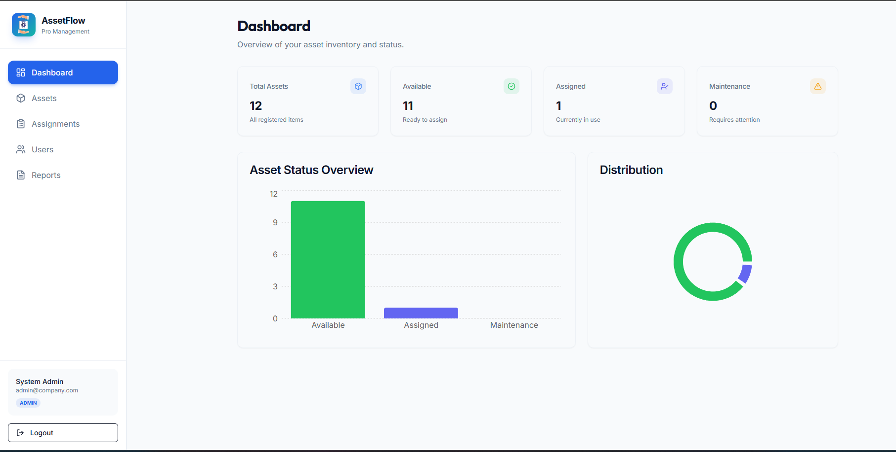
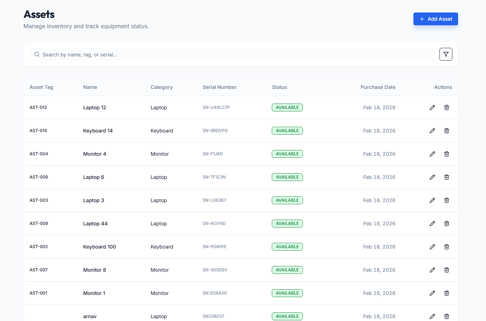
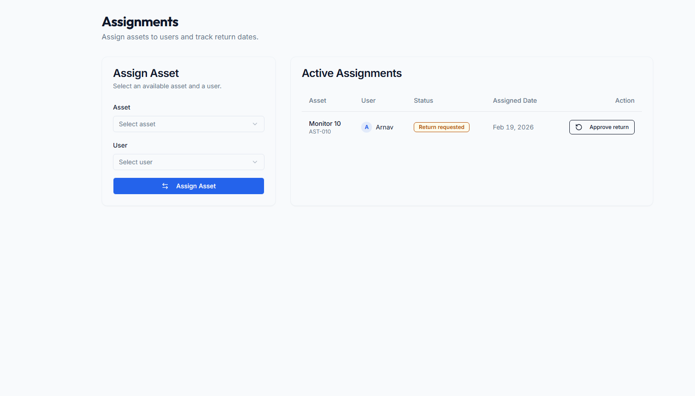
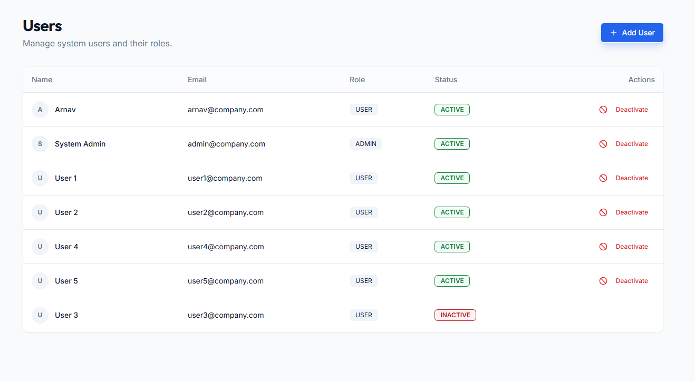
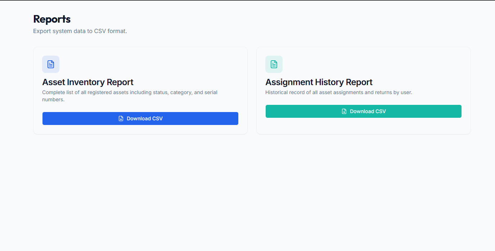

# Asset Management System (AMS)

A full-stack Asset Management System built with React, Node.js, Express, and PostgreSQL.

## Features

- **Authentication**: JWT-based login with role-based access control (Admin/User).
- **User Management**: Admins can create, update, and deactivate users.
- **Asset Management**: CRUD operations for assets.
- **Assignments**: Assign assets to users and return them.
- **Dashboard**: Real-time statistics.
- **Reports**: Downloadable CSV reports for assets and assignments.

### Admin Home Page



### Asset page



### Asset Tracking table



### User Tracking Page



### Data download Page



### User Home


## Tech Stack

- **Frontend**: React, Tailwind CSS, Shadcn UI, Recharts, React Query.
- **Backend**: Node.js, Express.
- **Database**: PostgreSQL (with Drizzle ORM).

## Setup

1. **Install Dependencies**:
   ```bash
   npm install
   ```

2. **Database Setup**:
   The database schema is managed via Drizzle ORM.
   ```bash
   npm run db:push
   ```

3. **Seeding**:
   The application automatically seeds the database with an Admin user, sample users, and assets on the first run if the user table is empty.

4. **Run Development Server**:
   ```bash
   npm run dev
   ```

## Default Credentials

**Admin**:
- Email: `admin@company.com`
- Password: `Admin@123`

**User**:
- Email: `user1@company.com` (up to user5)
- Password: `User@123`

## API Endpoints (summary)

### Auth
- `POST /api/auth/login`
- `GET /api/auth/me`

### Admin - Users
- `GET /api/admin/users`
- `POST /api/admin/users`
- `PUT /api/admin/users/:id`
- `PATCH /api/admin/users/:id/deactivate`

### Admin - Assets
- `GET /api/assets`
- `POST /api/admin/assets`
- `PUT /api/admin/assets/:id`
- `DELETE /api/admin/assets/:id`

### Admin - Assignments
- `GET /api/admin/assignments`
- `POST /api/admin/assignments`
- `POST /api/admin/assignments/return`

### Admin - Reports
- `GET /api/admin/reports/assets` (CSV)
- `GET /api/admin/reports/assignments` (CSV)

### User
- `GET /api/user/assets`
- `POST /api/user/assets/request-return`
